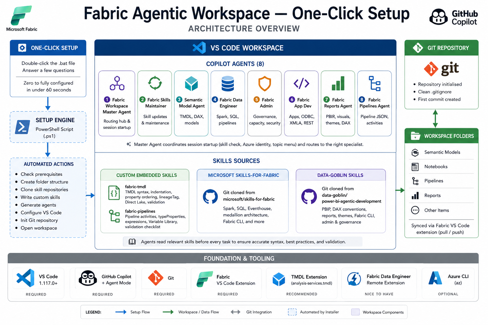
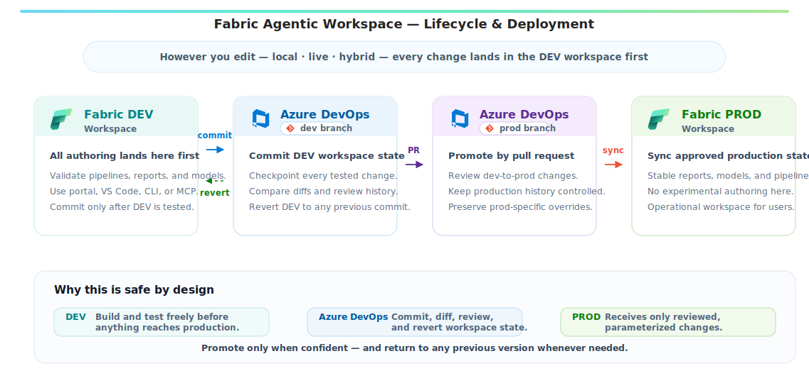

# Fabric Agentic Workspace — One-Click Setup

[](https://github.com/SteCiu01/Fabric-Agentic-Workspace-One-Click-Setup/releases)

Pre-release — functional and tested, evolving fast.
Contributions and feedback welcome.

**Zero to fully configured in under 60 seconds.**

Double-click one the .bat file, answer a few questions, and you have a complete
Microsoft Fabric agentic development environment with eight specialist AI
agents, custom skills for TMDL and pipeline authoring, and integration with
two open-source skill repositories — all inside VS Code.

---

<p align="center">
  
</p>

---

## Why this exists

This is a personal project — and like most personal projects, it started from a real need.

I was doing a lot of work across **Microsoft Fabric**: building semantic models, doing ETL with Spark notebooks, designing data pipelines, and managing workspaces — all while adapting my workflow to the dynamic and always evolving agentic development.

The **[Microsoft Fabric](https://marketplace.visualstudio.com/items?itemName=fabric.vscode-fabric)** and **[Fabric Data Engineering - Remote](https://marketplace.visualstudio.com/items?itemName=SynapseVSCode.vscode-synapse-remote)** VS Code extensions are great for syncing items locally and running notebooks against remote Spark. But the AI-assisted development experience felt like it could be improved: GitHub Copilot didn't know about TMDL syntax and DAX best practices — particularly my own conventions around table naming, measure structures, and folder organization — pipeline JSON structure, or the skills published by Microsoft and the community.

So I built a multi-agent workspace that brings everything together. A **master agent** coordinates session startup and routes to **specialist agents** — each focused on a specific Fabric workload (semantic models, data engineering, admin, reports, pipelines, app dev). They all read from **skill repositories** (Microsoft's [skills-for-fabric](https://github.com/microsoft/skills-for-fabric), data-goblin's [power-bi-agentic-development](https://github.com/data-goblin/power-bi-agentic-development)) and **custom embedded skills** for TMDL and pipeline authoring that I wrote from scratch.

Then I thought: *this should be replicable*. Not just for me — for anyone who works with Fabric and wants an AI-powered development workflow. So I packaged everything into a one-click installer and a shareable agent configuration.

---

> **⚠️ Disclaimer — Please read before using**
>
> This is a **personal and community project**, built in my spare time for fun and to share something useful. It is not an official Microsoft product, is not affiliated with Microsoft in any way, and comes with no guarantees of any kind.
>
> **AI involvement:** This project was built with significant help from **GitHub Copilot** in VS Code. Copilot assisted in writing the installer scripts, agent configuration files, custom skills, documentation, and a large portion of the "heavy lifting" — from structuring the codebase and handling edge cases, to generating boilerplate and refining prompts. The core ideas, design decisions, and testing are mine; the speed at which it came together is Copilot's.
>
> **Early stage — use with care:** This is very much a v0.1. It has been tested and works, but it is at the beginning of its life. Given the level of AI involvement in its creation, there may be bugs, edge cases, or behaviours that do not work as expected in your specific environment. **Do not use this in production environments without fully understanding what the scripts do.** Always review the code before running it.
>
> **Third-party skill dependencies:** This workspace clones and depends on two external repositories — [microsoft/skills-for-fabric](https://github.com/microsoft/skills-for-fabric) and [data-goblin/power-bi-agentic-development](https://github.com/data-goblin/power-bi-agentic-development). These are independent open-source projects maintained by their respective owners. This project has no control over their content, availability, or future changes. If either repository is renamed, moved, or removed, the installer and skill-update workflow will break until the references are updated. Always check those repos directly for their own licensing terms and usage conditions.
>
> That said — it is a genuinely interesting starting point, and I hope it saves you time and sparks ideas. Feedback, bug reports, and contributions are very welcome.

---

## What is this?

This is a **one-click workspace bootstrapper and multi-agent Copilot configuration**
for Microsoft Fabric development in VS Code. Instead of manually setting up
folders, config files, agent definitions, skill references, and cloning
repositories, you run a single script and everything is ready.

Once set up, a team of custom Copilot agents lives inside your workspace:
a **Master Agent** that coordinates session startup and routing, a **Skills
Maintainer** that keeps everything up to date, and **six specialist agents**
covering every major Fabric workload — all guided by skills from Microsoft,
the community, and custom embedded knowledge.

---

## What you get

| Component | Description |
|---|---|
| **Fabric Workspace Master Agent** | Routing hub — handles session startup (skill check, Azure identity, topic menu), then routes to the right specialist or handles tasks directly with dynamic skill discovery |
| **Fabric Skills Maintainer** | Light (quick pull) or deep (pull + MS docs freshness check + unreferenced skill scan) maintenance of all skill sources |
| **Semantic Model Agent** | TMDL editing, DAX measures, columns, relationships, partitions — guided by the custom fabric-tmdl skill and data-goblin DAX conventions |
| **Fabric Data Engineer** | Spark notebooks, SQL warehouse, pipelines, medallion architecture — guided by Microsoft's skills-for-fabric |
| **Fabric Admin** | Capacity management, governance, security, workspace documentation |
| **Fabric App Dev** | Python apps, ODBC, XMLA, REST API integration with Fabric data |
| **Fabric Reports Agent** | PBIR report editing, visuals, themes — guided by data-goblin report skills |
| **Fabric Pipelines Agent** | Data Factory pipeline JSON authoring — guided by the custom fabric-pipelines skill |
| **Custom TMDL Skill** | Comprehensive embedded skill covering TMDL syntax, indentation rules, property ordering, Direct Lake patterns, lineageTag rules, and post-edit validation |
| **Custom Pipelines Skill** | Full pipeline activity type reference with typeProperties, expression syntax, Variable Library integration, and validation checklist |
| **Microsoft skills-for-fabric** | Git-cloned from [microsoft/skills-for-fabric](https://github.com/microsoft/skills-for-fabric) — Spark, SQL, Eventhouse, medallion, and more |
| **Data-goblin skills** | Git-cloned from [data-goblin/power-bi-agentic-development](https://github.com/data-goblin/power-bi-agentic-development) — PBIP, DAX, reports, Fabric CLI, Fabric admin |
| **Git Version Control** | Repository initialised with a clean `.gitignore` and first commit out of the box |
| **VS Code Configuration** | Settings and tasks pre-configured for the agentic workflow |

---

## Prerequisites

Before running the installer, make sure you have:

| Tool | Required? | How to get it |
|---|---|---|
| **VS Code 1.117.0+** | Yes | [code.visualstudio.com](https://code.visualstudio.com) — older versions have known bugs that break Copilot agent tools |
| **GitHub Copilot + Agent Mode** | Yes | Install from VS Code Extensions marketplace. Agent mode must be enabled (`chat.agent.enabled`). Note: org tenants may need admin to enable this. |
| **Git** | Yes | [git-scm.com](https://git-scm.com) |
| **[Microsoft Fabric Extension](https://marketplace.visualstudio.com/items?itemName=fabric.vscode-fabric)** | Yes | Required for the pull/push workflow with Fabric. Install from VS Code marketplace or `code --install-extension fabric.vscode-fabric` |
| **[TMDL Extension](https://marketplace.visualstudio.com/items?itemName=analysis-services.tmdl)** | Recommended | Provides syntax highlighting and validation for `.tmdl` files |
| **[Fabric Data Engineer Remote](https://marketplace.visualstudio.com/items?itemName=SynapseVSCode.synapse)** | Nice to have | Execute notebook cells against remote Spark directly from VS Code |
| **az CLI** | Optional | Some agents use `az rest` for Fabric API calls. [Install](https://aka.ms/installazurecli) |

---

## Quick start

### 1. Get the files

You need **two files** — keep them in the same folder (ideally as they are in the [fabric-agentic-installer](https://github.com/SteCiu01/Fabric-Agentic-Workspace-One-Click-Setup/tree/main/fabric-agentic-installer) folder):

```
Setup-FabricAgenticWorkspace.bat    ← double-click this
Setup-FabricAgenticWorkspace.ps1    ← the engine (called by the .bat)
```

### 2. Run the installer

**Double-click `Setup-FabricAgenticWorkspace.bat`.**

You'll see a terminal window:

```
===============================================
 Fabric Agentic Workspace — One-click Setup
===============================================

  Do you already have a local folder where you work with Fabric?
  (e.g. where you sync your Semantic Models, Notebooks, Pipelines)

  [1] Yes — I have an existing folder (I will provide the path)
  [2] No  — Create a new folder for me

  Enter 1 or 2: _
```

Follow the prompts. The script will:

1. Ask for your workspace folder (existing or new)
2. Explain the Fabric Git integration workflow
3. Ask how many Fabric workspaces to scaffold
4. Check all prerequisites (git, VS Code, Fabric extension, TMDL extension, az CLI)
5. Create the folder structure
6. Clone Microsoft's skills-for-fabric and data-goblin's power-bi-agentic-development
7. Write custom skills (TMDL, Pipelines)
8. Generate all agent definitions (8 agents)
9. Write configuration files (Copilot instructions, AGENTS.md, .gitignore, VS Code settings)
10. Initialise a git repo with the first commit
11. Open the workspace in VS Code

### 3. Start working

Once VS Code opens:

1. Open **Copilot Chat** (sidebar or `Ctrl+Shift+I`)
2. Select **1 - Fabric Workspace Master Agent** from the agent dropdown
3. In a blank chat type a greeting (e.g., Hi agent!) — the agent takes over from here

On first message the agent will:
- Check when each skill source was last updated
- Offer to run skill maintenance (light or deep)
- Check your Azure identity (`az account show`)
- Present a topic menu to route you to the right specialist

### 4. Keeping it up to date

When a new version is released, updating is the same one step as installing:

1. [Download the latest installer files](https://github.com/SteCiu01/Fabric-Agentic-Workspace-One-Click-Setup/tree/main/fabric-agentic-installer)
2. **Double-click `Setup-FabricAgenticWorkspace.bat`** and point to the **same folder** you used originally
3. The installer detects the existing folder and switches to **update mode** — it refreshes agent definitions, custom skills, Copilot instructions, and VS Code configs, then pulls the latest skill repositories
4. Your Fabric items, workspace folders, and any personal files are **not touched**

That's it. Reopen the workspace in VS Code and you're on the latest version.

---

## What the agents can do

### Automated session startup

You don't configure anything manually. On your **first message** each session, the master agent automatically:

1. **Checks skill freshness** — shows when each skill source was last updated locally
2. **Offers maintenance** — optionally switches to the Skills Maintainer for a light or deep update
3. **Checks Azure identity** — runs `az account show` to verify your login
4. **Presents topic selection** — routes you to the specialist agent for your task

### Specialist agents

Once routed, the specialist agents handle their domain:

| Agent | What it handles |
|---|---|
| **Semantic Model Agent** | Create/edit TMDL files, write DAX measures, manage columns, relationships, partitions, Direct Lake models, Field Parameters. Reads the fabric-tmdl skill and data-goblin DAX conventions before every task. |
| **Fabric Data Engineer** | Design medallion architecture, develop Spark notebooks, author SQL objects, create Data Factory pipelines. Reads skills-for-fabric and the fabric-pipelines skill. |
| **Fabric Admin** | Capacity planning, governance validation, workspace inventory, RBAC, cost analysis. Uses az rest patterns from skills-for-fabric. |
| **Fabric App Dev** | Connect apps to Fabric via ODBC/XMLA/REST, build data access layers in Python, set up local dev environments with DefaultAzureCredential. |
| **Fabric Reports Agent** | Author PBIR report definitions, design visual layouts, apply themes, create report-level measures. Reads data-goblin report skills. |
| **Fabric Pipelines Agent** | Author pipeline JSON, configure activities (Copy, Notebook, ForEach, IfCondition, Refresh, etc.), manage parameters and expressions. Reads the fabric-pipelines skill. |

### Skill-based development

Every specialist agent reads the relevant skill files **before** generating any code or edits. Skills provide:

- **Exact syntax rules** — TMDL indentation (tabs only), property ordering, lineageTag handling
- **Activity type references** — every pipeline activity with its typeProperties
- **Best practices** — DAX conventions, naming patterns, validation checklists
- **File structure knowledge** — where things go in a Fabric PBIP project

The skills come from three sources:

| Source | What it covers | Updated |
|---|---|---|
| **Custom embedded** (`.github/skills/`) | TMDL syntax, pipeline JSON | Re-run installer or edit directly |
| **Microsoft** (`skills-for-fabric/`) | Spark, SQL, Eventhouse, medallion, CLI | Auto on session start |
| **Data-goblin** (`power-bi-agentic-development/`) | PBIP, DAX, reports, Fabric CLI/admin | Auto on session start |

> **Why git clone instead of npm install?** Corporate environments typically
> block npm global installs and require admin approval. This workspace clones
> the skills repos via git — which you already have — so there's zero extra
> tooling or permissions needed.

---

## Workspace structure

After setup, your folder looks like this:

```
Fabric Workspaces/
├── .git/
├── .github/
│   ├── agents/
│   │   ├── 1-fabric-workspace-master-agent.agent.md   ← routing hub
│   │   ├── 2-fabric-skills-maintainer.agent.md        ← skill maintenance
│   │   ├── 3-semantic-model-agent.agent.md            ← TMDL & DAX
│   │   ├── 4-fabric-data-engineer.agent.md            ← Spark, SQL, pipelines
│   │   ├── 5-fabric-admin.agent.md                    ← governance & capacity
│   │   ├── 6-fabric-app-dev.agent.md                  ← apps & integrations
│   │   ├── 7-fabric-reports-agent.agent.md            ← PBIR reports
│   │   └── 8-fabric-pipelines-agent.agent.md          ← pipeline JSON
│   ├── agent-docs/
│   │   ├── starting-flow.md                           ← session startup phases
│   │   └── working-flow-reference.md                  ← skill discovery table
│   ├── copilot-instructions.md                        ← workspace-level context
│   └── skills/
│       ├── fabric-tmdl/
│       │   └── SKILL.md                               ← TMDL syntax & rules
│       └── fabric-pipelines/
│           └── SKILL.md                               ← pipeline activity reference
├── .gitignore
├── .vscode/
│   ├── settings.json
│   └── tasks.json
├── AGENTS.md                                          ← quick-reference guide
├── skills-for-fabric/                                 ← Microsoft skills (gitignored)
│   ├── skills/
│   └── common/
├── power-bi-agentic-development/                      ← data-goblin skills (gitignored)
│   └── plugins/
└── <Your Workspace Folders>/                          ← Fabric items synced here
```

Fabric items are synced into workspace sub-folders via the Fabric VS Code
extension. The agents work on those files locally — editing TMDL, DAX,
pipeline JSON, notebooks — and you push changes back via the extension.

---

## How it works under the hood

The setup script (`Setup-FabricAgenticWorkspace.ps1`) is fully self-contained.
It does not download anything except the two public skill repositories.
Every agent definition, custom skill, and config file is embedded directly in
the script — no external templates, no internet dependencies beyond `git clone`.

The `.bat` wrapper exists solely to bypass Windows PowerShell execution policy
restrictions. It calls the `.ps1` with `-ExecutionPolicy Bypass` so the script
runs regardless of your organisation's policy settings.

The script supports **update mode** — if you run it against an existing folder, it
overwrites all installation-managed files (agent definitions, custom skills, configs)
with the latest versions while leaving your Fabric items, workspace folders, and
personal files completely untouched.

### The Fabric Git integration workflow

This workspace integrates with Fabric's native Git support and Azure DevOps for a full development-to-production lifecycle:

<p align="center">
  
</p>

#### How the workflow operates

The workflow uses **three layers** working together: a local VS Code workspace for AI-assisted editing, a Fabric DEV workspace for testing, and Azure DevOps for version control and production promotion.

**Local development (VS Code + AI Agents ↔ Fabric DEV Workspace)**

1. Create a local folder (e.g. `C:\Users\you\Fabric Workspaces\`) with one sub-folder per Fabric workspace. This installer creates the folder pre-configured with optimised Fabric/Power BI agents and skills.
2. In VS Code, activate **Copilot Chat** (with agents) and the **Fabric extension** — both are mandatory.
3. Use the Fabric extension to **pull** (download) items from your DEV workspace to the local folder — semantic models, notebooks, pipelines, reports, etc.
4. **Edit locally** using AI agents or manually. The agents understand TMDL, DAX, pipeline JSON, and notebook formats natively.
5. **Push** your changes back to the DEV workspace via the Fabric extension. They go live in the DEV workspace immediately.
6. **Test in the Fabric portal** — verify everything works as expected. Make any additional manual amendments directly in the portal if needed (the workflow is mixed: local AI + portal manual).

**Version control and safety net (Fabric DEV Workspace ↔ Azure DevOps)**

7. **Happy with the changes?** In the Fabric portal, go to Workspace Settings → Git Integration and **commit** your items to the Azure DevOps **DEV branch**. This creates a versioned backup of your current state.
8. **Not happy?** **Revert** from the DevOps DEV branch to roll back to any previous committed version. This undoes both VS Code and portal changes — your safety net.

**Promotion to production (Azure DevOps → Fabric PROD Workspace)**

9. When the DEV branch is stable and tested, create a **Pull Request** in Azure DevOps from the DEV branch to the PROD branch.
10. The PROD branch maintains **parameterized overrides** — for example, pipeline schedules turned ON (off in DEV), production connection endpoints, and environment-specific settings. These overrides persist across deployments, so each new PR only brings the item logic changes without resetting prod-specific configuration.
11. After the PR is approved and merged, **sync** the PROD branch to the Fabric PROD workspace via Fabric Git Integration. The production workspace is now updated.

**Why this approach works:**
- **DEV workspace** = live testing ground — iterate fast with both AI and manual edits
- **Azure DevOps** = backup, versioning, and gated promotion — revert anytime, deploy when confident
- **PROD workspace** = stable production with its own parameterized settings that survive deployments
- **No risk**: you can always revert DEV from DevOps, and PROD is only updated through a deliberate PR + sync process

---

## FAQ

**Q: Can I move the workspace folder after creation?**
A: Yes. The workspace is fully portable. Just open the new location in VS Code.

**Q: What if I don't have the Fabric extension installed?**
A: The installer will warn you prominently but still create everything. Install
the extension before using the pull/push workflow with Fabric.

**Q: Does this work on macOS or Linux?**
A: The setup script is Windows-only (PowerShell + .bat). However, the
workspace itself — including all agents and skills — works on any OS once the
files exist. You'd just need to create the folder structure manually or adapt
the script.

**Q: Why does this clone skills via git instead of installing them?**
A: The official way to install some skills is via npm global install, which
requires admin/elevated rights on most corporate machines and often needs IT
approval. By git-cloning the repos directly, this workspace avoids that
entirely — you only need git, which is already a prerequisite.

**Q: Can I add my own specialist agents?**
A: Absolutely. Create a new `.agent.md` file in `.github/agents/` and it will
appear in the Copilot Chat dropdown. Follow the existing agent structure.

**Q: How do I update the skills?**
A: The master agent offers skill maintenance at session start. You can also
select the Skills Maintainer directly for light (git pull) or deep (pull +
freshness check) maintenance.

**Q: Can multiple people share the same workspace via git?**
A: Yes. Push the workspace to a shared repo. Each team member clones it,
selects the Master Agent, and connects to their own Fabric environment.
The `.gitignore` keeps skill repos and VS Code settings clean.

---

## Current status (v0.1.0-preview)

| Area | Status |
|---|---|
| One-click setup (.bat + .ps1) | **Working** — tested on Windows 10/11 |
| Master Agent session startup flow | **Working** — skill check, az identity, topic routing |
| Specialist agent routing | **Working** — all 6 specialist agents functional |
| Skills Maintainer (light + deep) | **Working** — pull, freshness check, unreferenced scan |
| Custom TMDL skill | **Working** — comprehensive syntax and validation rules |
| Custom Pipelines skill | **Working** — full activity type reference |
| Microsoft skills-for-fabric integration | **Working** — cloned and auto-updated |
| Data-goblin skills integration | **Working** — cloned and auto-updated |
| Idempotent re-run (update mode) | **Working** — managed files refreshed, user files untouched |

This is a pre-release. Expect rough edges. If something breaks, [open an issue](https://github.com/SteCiu01/Fabric-Agentic-Workspace-One-Click-Setup/issues).

---

## Contributing

This project is open source and actively looking for feedback, ideas, and
improvements from the community. All contributions are welcome — from typo
fixes to new agent workflows to cross-platform support.

See **[CONTRIBUTING.md](CONTRIBUTING.md)** for the full guide — how to set up,
branch naming, commit style, and PR expectations.

Quick links:
- [Report a bug](https://github.com/SteCiu01/Fabric-Agentic-Workspace-One-Click-Setup/issues/new?template=bug_report.yml)
- [Request a feature](https://github.com/SteCiu01/Fabric-Agentic-Workspace-One-Click-Setup/issues/new?template=feature_request.yml)
- [Open issues](https://github.com/SteCiu01/Fabric-Agentic-Workspace-One-Click-Setup/issues)

---

## Files in this repository

| File | Purpose |
|---|---|
| `fabric-agentic-installer/Setup-FabricAgenticWorkspace.bat` | Double-click entry point — share this with your team |
| `fabric-agentic-installer/Setup-FabricAgenticWorkspace.ps1` | The full installer — must be in the same folder as the .bat |
| `CHANGELOG.md` | Version history and release notes |
| `CONTRIBUTING.md` | Guide for contributors |
| `CODE_OF_CONDUCT.md` | Community standards |
| `SECURITY.md` | How to report security vulnerabilities |
| `LICENSE` | MIT License |
| `README.md` | This file |

---

## License

This project is licensed under the MIT License — see the [LICENSE](https://github.com/SteCiu01/Fabric-Agentic-Workspace-One-Click-Setup/blob/main/LICENSE) file for details.

## Third-party notices

This project integrates and references third-party open-source skill repositories
that remain the property of their respective authors and are licensed separately.

See [THIRD_PARTY_NOTICES.md](THIRD_PARTY_NOTICES.md) for attribution,
repository links, and license information.
