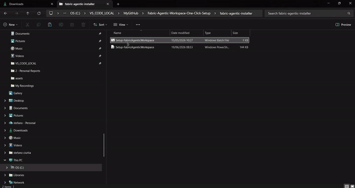
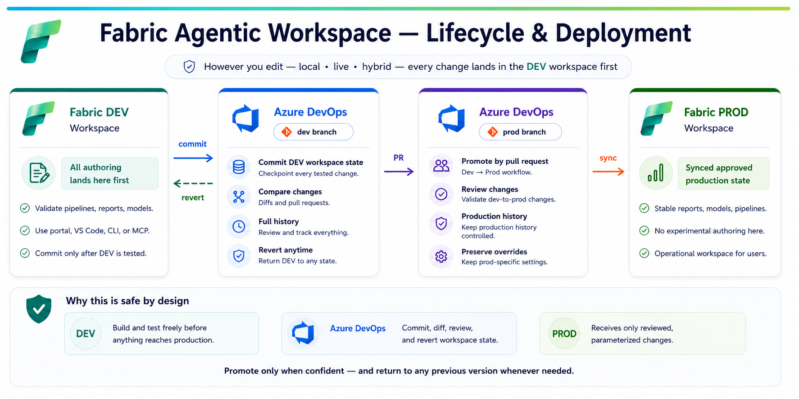
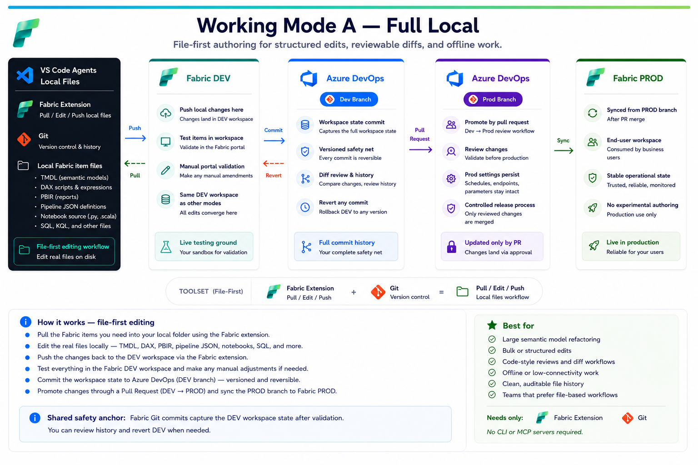
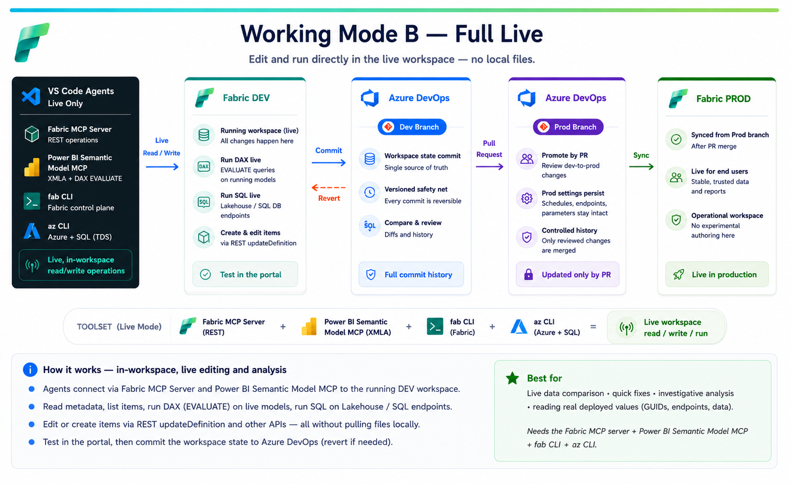
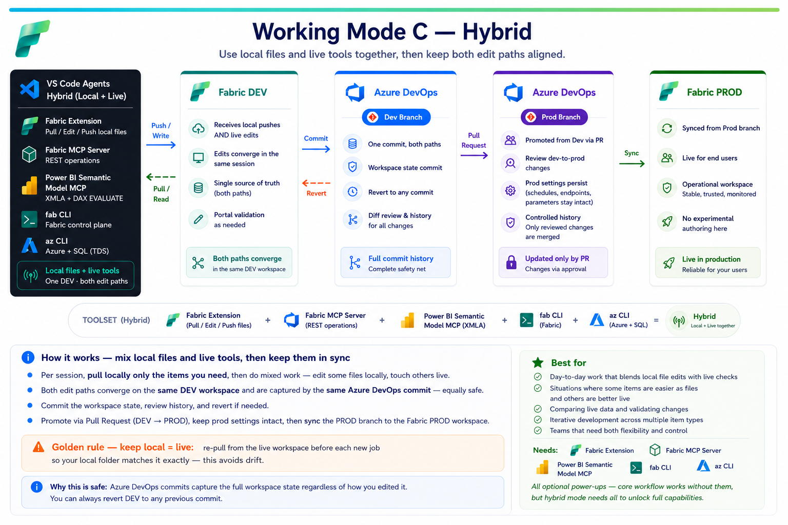

# Fabric Agentic Workspace — One-Click Setup

[](https://github.com/SteCiu01/Fabric-Agentic-Workspace-One-Click-Setup/releases)

Pre-release — functional and tested, evolving fast.
Contributions and feedback welcome.

**Zero to fully configured in under 5 minutes.**

Double-click the `.bat` file, answer a few questions, and get an opinionated
Microsoft Fabric agentic workspace in VS Code — with eight Copilot agents,
three embedded Fabric skills, two curated open-source skill sources, optional
CLI/MCP live tooling, and a governed DEV-to-PROD workflow.

---

<p align="center">
  
</p>

## Installation demo

The demo video demonstrates the one-click installation flow: launch the
installer, answer the setup prompts, let the workspace scaffold, and open the
configured VS Code environment with agents, skills, and optional live tooling
ready to use.

<p align="center">
  
</p>

In this recording, the main requirements are already installed. If they are not
present on your machine, the installer will attempt to install them
automatically. 

⚠️ The Azure CLI (`az`) is the dependency most likely to take longer
when it needs to be installed from scratch.

---

## Why this exists

This is a personal project — and like most personal projects, it started from a real need.

I was doing a lot of work across **Microsoft Fabric**: building semantic models, doing ETL with Spark notebooks, designing data pipelines, and managing workspaces — all while adapting my workflow to the dynamic and always evolving agentic development.

The **[Microsoft Fabric](https://marketplace.visualstudio.com/items?itemName=fabric.vscode-fabric)** and **[Fabric Data Engineering - Remote](https://marketplace.visualstudio.com/items?itemName=SynapseVSCode.vscode-synapse-remote)** VS Code extensions are great for syncing items locally and running notebooks against remote Spark. But the AI-assisted development experience felt like it could be improved: GitHub Copilot didn't know about my TMDL and DAX best practices — particularly my own conventions around table naming, measure structures, and folder organization. Furthermore data pipeline JSON authoring wasn't really covered anywhere I looked.

So I built a multi-agent workspace that brings everything together. A **master agent** coordinates session startup and routes to **specialist agents** — each focused on a specific Fabric workload (semantic models, data engineering, admin, reports, pipelines, app dev). They all read from what I consider the best skill repositories from the community — Microsoft's [skills-for-fabric](https://github.com/microsoft/skills-for-fabric) and data-goblin's [power-bi-agentic-development](https://github.com/data-goblin/power-bi-agentic-development) — plus **custom embedded skills** for TMDL and data pipeline authoring that I wrote from scratch and keep updating, based on my job and the problems I face there.

Then I thought: *this should be replicable*. Not just for me — for anyone who works with Fabric and wants an AI-powered development workflow. So I packaged everything into a one-click installer and a shareable agent configuration.

---

> **⚠️ Disclaimer — Please read before using**
>
> This is a **personal and community project**, built in my spare time for fun and to share something useful. It is not an official Microsoft product, is not affiliated with Microsoft in any way, and comes with no guarantees of any kind.
>
> **AI involvement:** This project was built with significant help from **GitHub Copilot** in VS Code. Copilot assisted in writing the installer scripts, agent configuration files, custom skills, documentation, and a large portion of the "heavy lifting" — from structuring the codebase and handling edge cases, to generating boilerplate and refining prompts. The core ideas, design decisions, and testing are mine; the speed at which it came together is Copilot's.
>
> **Early stage — use with care:** This is very much a pre-release version. It has been tested and works, but it is at the beginning of its life. Given the level of AI involvement in its creation, there may be bugs, edge cases, or behaviours that do not work as expected in your specific environment. **Do not use this in production environments without fully understanding what the scripts do.** Always review the code before running it.
>
> **Third-party skill dependencies:** This workspace clones and depends on two external repositories — [microsoft/skills-for-fabric](https://github.com/microsoft/skills-for-fabric) and [data-goblin/power-bi-agentic-development](https://github.com/data-goblin/power-bi-agentic-development). These are independent open-source projects maintained by their respective owners. This project has no control over their content, availability, or future changes. The agents are **resilient to these repos restructuring or renaming their internal folders** — skills are discovered dynamically at runtime (list the repo root, search by keyword) rather than from fixed paths. However, if a whole repository is **renamed, moved, or removed** at the GitHub level, or its history diverges so `git pull --ff-only` fails, the clone/update step will break until the references are updated.
>
> **Licensing & provenance:** `skills-for-fabric` is MIT-licensed; `power-bi-agentic-development` is **GPL-3.0** and is used **only as a locally cloned, gitignored reference** that agents read at runtime — it is never copied, AI-rewritten, or redistributed inside this project. The custom embedded skills (`fabric-tmdl`, `fabric-pipelines`, and `fabric-cli-policy`) are **independent, proprietary works original to this repository** — written from scratch (`fabric-tmdl` and `fabric-cli-policy` from my own best practices; `fabric-pipelines` derived from Microsoft sources combined with my working experience) and owned by this project. Always check those repos directly for their own licensing terms and usage conditions.
>
> That said — it is a genuinely interesting starting point, and I hope it saves you time and sparks ideas. Feedback, bug reports, and contributions are very welcome.

---

## What is this?

This is a **one-click workspace bootstrapper and multi-agent Copilot configuration**
for Microsoft Fabric development in VS Code. Instead of manually setting up
folders, config files, agent definitions, skill references, and cloning
repositories, you run a single script and everything is ready.

Once set up, a team of custom Copilot agents lives inside your workspace:
a **Master Agent** that coordinates session startup and routing, a **Skills
Maintainer** that keeps everything up to date, and **six specialist agents**
covering every major Fabric workload — all guided by skills from Microsoft,
the community, and custom embedded knowledge.

---

## What you get

| Component | Description |
|---|---|
| **Fabric Workspace Master Agent** | Routing hub — handles session startup (skill check, Azure identity, topic menu), then routes to the right specialist or handles tasks directly with dynamic skill discovery. Can also proactively recommend the best specialist for a free-text request |
| **Fabric Skills Maintainer Agent** | Light (quick pull) or deep (pull + MS docs freshness check + unreferenced skill scan) maintenance of all skill sources |
| **Semantic Model Agent** | TMDL editing, DAX measures, columns, relationships, partitions — house style from the custom fabric-tmdl skill, syntax/DAX depth from data-goblin (explicit precedence) |
| **Fabric Data Engineer Agent** | Spark notebooks, SQL warehouse, pipelines, medallion architecture — guided by Microsoft's skills-for-fabric |
| **Fabric Admin Agent** | Capacity management, governance, security, workspace documentation |
| **Fabric App Dev Agent** | Python apps, ODBC, XMLA, REST API integration with Fabric data |
| **Fabric Reports Agent** | PBIR report editing, visuals, themes — guided by data-goblin report skills |
| **Fabric Pipelines Agent** | Data Factory pipeline JSON authoring — guided by the custom fabric-pipelines skill |
| **Custom TMDL Skill** *(proprietary — original to this repo)* | Comprehensive embedded skill covering TMDL syntax, indentation rules, property ordering, Direct Lake patterns, lineageTag rules, and post-edit validation. Written from scratch for this project. |
| **Custom Pipelines Skill** *(proprietary — original to this repo)* | Full pipeline activity type reference with typeProperties, expression syntax, Variable Library integration, and validation checklist. Authored for this project. |
| **Custom CLI Policy Skill** *(proprietary — original to this repo)* | Embedded decision policy that tells the agents to prefer the Fabric CLI (`fab`) and fall back to `az`/`sqlcmd` only where needed — with `az rest` → `fab api` translation, a fallback matrix for SQL/TDS and non-Fabric tokens, and guardrails. Written from scratch for this project. |
| **Microsoft skills-for-fabric** | Git-cloned from [microsoft/skills-for-fabric](https://github.com/microsoft/skills-for-fabric) — Spark, SQL, Eventhouse, medallion, and more |
| **Data-goblin skills** | Git-cloned from [data-goblin/power-bi-agentic-development](https://github.com/data-goblin/power-bi-agentic-development) by [Kurt Buhler](https://www.linkedin.com/in/kurtbuhler/) — PBIP, DAX, reports, Fabric CLI, Fabric admin |
| **Git Version Control** | Repository initialised with a clean `.gitignore` and first commit out of the box |
| **VS Code Configuration** | Settings and tasks pre-configured for the agentic workflow |

---

## Prerequisites

Before running the installer, make sure you have:

| Tool | Required? | How to get it |
|---|---|---|
| **VS Code 1.117.0+** | Required | **You install it** — [code.visualstudio.com](https://code.visualstudio.com). The installer checks the version and **stops** if it's missing; older versions have known bugs that break Copilot agent tools. |
| **GitHub Copilot + Agent Mode** | Required | **You install it** — from the VS Code Extensions marketplace. Agent mode must be enabled (`chat.agent.enabled`). The installer does not install or check this; org tenants may need admin to enable it. |
| **Git** | Required | **You install it** — [git-scm.com](https://git-scm.com). The installer checks for Git and **stops** if it's missing; it does not install Git. |
| **[Microsoft Fabric Extension](https://marketplace.visualstudio.com/items?itemName=fabric.vscode-fabric)** | Required | **You install it** — VS Code marketplace or `code --install-extension fabric.vscode-fabric`. Required for the pull/push workflow with Fabric. The installer **checks and warns** if it's missing, but does not install it. |
| **[TMDL Extension](https://marketplace.visualstudio.com/items?itemName=analysis-services.tmdl)** | Recommended | **You install it** — `code --install-extension analysis-services.tmdl`. Syntax highlighting and validation for `.tmdl` files. The installer **checks and reminds you**, but does not install it. |
| **[Fabric Data Engineer Remote](https://marketplace.visualstudio.com/items?itemName=synapsevscode.vscode-synapse-remote)** | Nice to have | **You install it** — run notebook cells against remote Spark from VS Code. The installer mentions it as a tip but does not install it. |
| **Python 3.10–3.13** | Installer auto-installs (if needed) | **Installer installs it where possible** — only if no real Python 3 is found. It attempts Python 3.12 via winget `Python.Python.3.12 --scope user`, then the python.org 3.12.10 per-user installer. Skipped entirely if you already have Python (e.g. Anaconda). Needed only for the `fab`/`az` CLIs. [python.org](https://www.python.org) |
| **Fabric CLI (`fab`)** | Installer auto-installs (recommended) | **Installer installs it where possible** — primary CLI the agents use for Fabric API, jobs, export/import, OneLake & table ops. Once a real Python is available it runs `pip install ms-fabric-cli` with a `--user` retry. Continues if corporate policy, network, or Python/pip blocks it. [Repo](https://github.com/microsoft/fabric-cli) |
| **az CLI** | Installer auto-installs (fallback) | **Installer installs it where possible** — only needed for SQL/TDS (`sqlcmd -G`) and non-Fabric token audiences; `fab` covers the rest. Tries winget `Microsoft.AzureCLI` first, then pip / `--user` pip if Python is available. The winget path may be blocked or require elevation depending on company policy; failure is non-blocking. [Install](https://aka.ms/installazurecli) |
| **Fabric MCP server** | Installer auto-installs (full-live / hybrid) | **Installer installs it where possible** — VS Code extension `fabric.vscode-fabric-mcp-server`, giving agents structured Fabric operations (create/list items, OneLake files & tables, read item definitions). Attempts `code --install-extension ... --force`. Not needed for full-local mode. |
| **Power BI semantic-model MCP server** | Installer auto-installs (full-live / hybrid) | **Installer installs it where possible** — VS Code extension `analysis-services.powerbi-modeling-mcp`, a live XMLA connection to running models (run DAX `EVALUATE` for live comparison, make transactional model edits). Attempts `code --install-extension ... --force`. Not needed for full-local mode. |

> **CLIs and MCP servers are optional power-ups.** The core full-local workflow — the Fabric extension plus agents editing local files — needs no CLI or MCP server at all. They add terminal, control-plane/data-plane and live-workspace power on top, and are what unlock the **full-live** and **hybrid** ways of working (see [Three ways of working](#three-ways-of-working)). The installer **attempts to install** Python, `fab` (recommended), `az` (fallback), and the two MCP server extensions where possible — and if your environment blocks an optional install (corporate policy, no winget, no network, no Python/pip, or VS Code extension restrictions), it shows a warning for that item and continues. For a deep dive into what you can do once a CLI is installed, see [CLI-FUNCTIONALITIES.md](CLI-FUNCTIONALITIES.md).

---

## Quick start

> [!WARNING]
> **What the installer puts on your machine — read before running.** The installer is convenient but it is **not** just a folder creator: it also writes workspace files, clones public repositories, and attempts a small set of tool installs. Everything it touches is listed below so there are no surprises. Optional tool installs are **best-effort and non-blocking** — if your environment blocks one (corporate policy, no winget, no network, no Python/pip, or VS Code extension restrictions), the installer continues and prints what to install later. **Git and VS Code 1.117.0+ are required prerequisites; if they are missing, setup stops.**
>
> **In your chosen workspace folder, it will:**
> - Create the workspace folder and one sub-folder per Fabric workspace you choose to scaffold
> - Write or refresh installer-managed files: agent definitions (8 agents), custom skills (TMDL, Pipelines, CLI policy), Copilot instructions, `AGENTS.md`, `.gitignore`, and VS Code settings/tasks
> - Initialise a Git repository if the folder is not already a repo; create the first commit only if Git `user.name` and `user.email` are configured
> - Clone two public GitHub repositories into the folder if missing, or run `git pull --ff-only` if they already exist: [`microsoft/skills-for-fabric`](https://github.com/microsoft/skills-for-fabric) and [`data-goblin/power-bi-agentic-development`](https://github.com/data-goblin/power-bi-agentic-development). If cloning or pulling is blocked, the installer warns and continues.
>
> **On your system, software is handled in two clearly separate groups — so you know what the script attempts to install and what it only checks:**
>
> **① Attempted automatically for you** *(best-effort; failures are warnings, not setup blockers):*
> - **Python** — only if no real Python 3 executable is found. The installer attempts Python 3.12 via winget `Python.Python.3.12 --scope user`, then the official python.org Python 3.12.10 installer with per-user settings (`InstallAllUsers=0`, `PrependPath=1`, `Include_pip=1`).
> - **Fabric CLI `fab`** — only if `fab` is missing. After a real Python is available, the installer runs `python -m pip install --upgrade ms-fabric-cli`, then retries with `--user` if needed, and adds discovered Python Scripts folders to the user PATH.
> - **Azure CLI `az`** — only if `az` is missing. The installer tries winget `Microsoft.AzureCLI` first; that package may be blocked or may request elevation depending on company policy. If a real Python exists, it then tries `pip install azure-cli` and `pip install --user azure-cli`. Failure is non-blocking.
> - **Two VS Code MCP-server extensions** — only if missing and the VS Code CLI is available: `fabric.vscode-fabric-mcp-server` and `analysis-services.powerbi-modeling-mcp`, via `code --install-extension <id> --force`. These power full-live/hybrid mode; full-local mode does not need them.
>
> **② Checked only — you install these yourself** *(the script does not install them):*
> - **Fabric extension** `fabric.vscode-fabric` — required for the core pull/push file workflow. If missing, the installer shows a prominent warning and continues.
> - **TMDL extension** `analysis-services.tmdl` — recommended for `.tmdl` syntax highlighting and validation. If missing, the installer reminds you and continues.
> - **Fabric Data Engineer Remote** `synapsevscode.vscode-synapse-remote` — optional for running notebook cells against remote Spark. The installer mentions it as a tip; it does not install it.
>
> **In short:** the installer attempts to bring the niche pieces that power CLI/live-agent scenarios (Python if needed, `fab`, `az`, and the two MCP server extensions), but it does not force them if your company environment blocks them. The mainstream authoring extensions remain your choice: the script checks and warns, but does not install them.
>
> **Update mode:** if you point it at an existing folder, it refreshes installer-managed files (agents, embedded skills, configs) and updates the cloned skill repositories when possible. Your Fabric item folders, workspace folders, and personal files are left untouched.

#### ⚠️⚠️⚠️ Corporate / locked-down PCs — if tools "install but aren't recognized"

On managed machines you may see optional tools (Python, `fab`, `az`, the MCP extensions) **get installed but still reported as "not found"** in the same run — often with a `pip` line ending in `exit code: -1` or a `WARNING: The script … is installed in '…\Scripts' which is not on PATH`. **This is expected, not a failure.** A freshly installed command isn't on `PATH` yet, and corporate security scanners (EDR/antivirus) add a delay or interrupt the install partway, so it finishes across a couple of runs.

The installer is **idempotent and self-healing**: on every run it refreshes `PATH` from the registry and re-scans the Python Scripts folders, so each run *recognizes what the previous run installed*. Do this, in order:

1. **Close the window and double-click the installer again — 2 to 4 times.** Each run picks up what the last one installed, so the "not found" list shrinks until it clears. (Re-running is safe: it's update mode — your files are never touched.)
2. **If an optional tool is still missing after 3–4 runs**, open the workspace in VS Code, select **1 - Fabric Workspace Master Agent** in Copilot Chat, and paste the prompt below. It covers exactly the optional tools the installer tries to install — the agent re-checks them and installs only the missing ones (per-user, no admin). *(Required tools — Git, VS Code, the Fabric extension — and the recommended TMDL extension you install yourself; see the table above.)*

```text
Please finish setting up this Fabric agentic workspace. The one-click installer already
tried to install a small set of OPTIONAL tools for me, but one or more may have failed on
this corporate PC. Check ONLY the tools listed below, tell me which are present vs missing,
then install ONLY the missing ones. Prefer per-user, no-admin installs and never force
anything that needs elevation.

  1. Python 3.10-3.13 (only if no real Python exists) -> winget install Python.Python.3.12 --scope user
  2. Fabric CLI "fab"            -> python -m pip install --user ms-fabric-cli
  3. Azure CLI "az" (fallback)   -> python -m pip install --user azure-cli
  4. Fabric MCP server           -> code --install-extension fabric.vscode-fabric-mcp-server
  5. Power BI model MCP server   -> code --install-extension analysis-services.powerbi-modeling-mcp

For the Python packages, add the user Scripts folder to PATH if needed, then verify each
tool resolves (run: fab --version, az version). Finish with a clear checklist of what is
now installed and what still needs manual or IT action. Do not run anything destructive.
```

> During its prerequisite step the installer shows each tool's status and a plain warning for anything optional it couldn't install — it does **not** print this prompt. Use the steps above if an optional tool is still missing. None of these optional tools block setup: the full-local workflow runs fine without them.

### 1. Get the files

You need **two files** — keep them in the same folder (ideally as they are in the [fabric-agentic-installer](https://github.com/SteCiu01/Fabric-Agentic-Workspace-One-Click-Setup/tree/main/fabric-agentic-installer) folder):

```
Setup-FabricAgenticWorkspace.bat    ← double-click this
Setup-FabricAgenticWorkspace.ps1    ← the engine (called by the .bat)
```

### 2. Run the installer

**Double-click `Setup-FabricAgenticWorkspace.bat`.**

You'll see a terminal window:

```
===============================================
 Fabric Agentic Workspace — One-click Setup
===============================================

  Do you already have a local folder where you work with Fabric?
  (e.g. where you sync your Semantic Models, Notebooks, Pipelines)

  [1] Yes — I have an existing folder (I will provide the path)
  [2] No  — Create a new folder for me

  Enter 1 or 2: _
```

Follow the prompts. The script will:

1. Ask for your workspace folder (existing or new)
2. Explain the Fabric development lifecycle and the three ways of working
3. Ask how many Fabric workspaces to scaffold
4. Check all prerequisites (git, VS Code, Fabric extension, TMDL extension) and automatically install Python, the `fab`/`az` CLIs, and the two MCP extensions where possible
5. Create the folder structure
6. Clone Microsoft's skills-for-fabric and data-goblin's power-bi-agentic-development
7. Write custom skills (TMDL, Pipelines, CLI policy)
8. Generate all agent definitions (8 agents)
9. Write configuration files (Copilot instructions, AGENTS.md, .gitignore, VS Code settings)
10. Initialise a git repo with the first commit
11. Open the workspace in VS Code

### 3. Start working

Once VS Code opens:

1. Open **Copilot Chat** (sidebar or `Ctrl+Shift+I`)
2. Select **1 - Fabric Workspace Master Agent** from the agent dropdown
3. In a blank chat type a greeting (e.g., Hi agent!) — the agent takes over from here

On first message the agent will:
- Check when each skill source was last updated
- Offer to run skill maintenance (light or deep)
- Check your identity (`fab auth status`, falling back to `az account show`)
- Present a topic menu to route you to the right specialist

### 4. Keeping it up to date

When a new version is released, updating is the same one step as installing:

1. [Download the latest installer files](https://github.com/SteCiu01/Fabric-Agentic-Workspace-One-Click-Setup/tree/main/fabric-agentic-installer)
2. **Double-click `Setup-FabricAgenticWorkspace.bat`** and point to the **same folder** you used originally
3. The installer detects the existing folder and switches to **update mode** — it refreshes agent definitions, custom skills, Copilot instructions, and VS Code configs, then pulls the latest skill repositories
4. Your Fabric items, workspace folders, and any personal files are **not touched**

That's it. Reopen the workspace in VS Code and you're on the latest version.

---

## What the agents can do

### Automated session startup

You don't configure anything manually. On your **first message** each session, the master agent automatically:

1. **Checks skill freshness** — shows when each skill source was last updated locally
2. **Offers maintenance** — optionally switches to the Skills Maintainer for a light or deep update
3. **Checks identity** — runs `fab auth status` (falling back to `az account show`) to verify your login
4. **Presents topic selection** — routes you to the specialist agent for your task

### Specialist agents

Once routed, the specialist agents handle their domain:

| Agent | What it handles |
|---|---|
| **Semantic Model Agent** | Create/edit TMDL files, write DAX measures, manage columns, relationships, partitions, Direct Lake models, Field Parameters. Reads the fabric-tmdl skill and data-goblin DAX conventions before every task. |
| **Fabric Data Engineer** | Design medallion architecture, develop Spark notebooks, author SQL objects, create Data Factory pipelines. Reads skills-for-fabric and the fabric-pipelines skill. |
| **Fabric Admin** | Capacity planning, governance validation, workspace inventory, RBAC, cost analysis. Prefers the Fabric CLI (`fab api`); falls back to `az rest` patterns from skills-for-fabric. |
| **Fabric App Dev** | Connect apps to Fabric via ODBC/XMLA/REST, build data access layers in Python, set up local dev environments with DefaultAzureCredential. |
| **Fabric Reports Agent** | Author PBIR report definitions, design visual layouts, apply themes, create report-level measures. Reads data-goblin report skills. |
| **Fabric Pipelines Agent** | Author pipeline JSON, configure activities (Copy, Notebook, ForEach, IfCondition, Refresh, etc.), manage parameters and expressions. Reads the fabric-pipelines skill. |

### Skill-based development

Every specialist agent reads the relevant skill files **before** generating any code or edits. Skills provide:

- **Exact syntax rules** — TMDL indentation (tabs only), property ordering, lineageTag handling
- **Activity type references** — every pipeline activity with its typeProperties
- **Best practices** — DAX conventions, naming patterns, validation checklists
- **File structure knowledge** — where things go in a Fabric PBIP project

The skills come from three sources:

| Source | What it covers | Updated |
|---|---|---|
| **Custom embedded** (`.github/skills/`) | TMDL syntax, pipeline JSON, CLI policy — *proprietary, original to this repo* | Re-run installer or edit directly |
| **Microsoft** (`skills-for-fabric/`) | Spark, SQL, Eventhouse, medallion, CLI | Auto on session start |
| **Data-goblin** — [Kurt Buhler](https://www.linkedin.com/in/kurtbuhler/) (`power-bi-agentic-development/`) | PBIP, DAX, reports, Fabric CLI/admin | Auto on session start |

> **Why git clone instead of npm install?** Corporate environments typically
> block npm global installs and require admin approval. This workspace clones
> the skills repos via git — which you already have — so there's zero extra
> tooling or permissions needed.

---

## Workspace structure

After setup, your folder looks like this:

```
Fabric Workspaces/
├── .git/
├── .github/
│   ├── agents/
│   │   ├── 1-fabric-workspace-master-agent.agent.md   ← routing hub
│   │   ├── 2-fabric-skills-maintainer.agent.md        ← skill maintenance
│   │   ├── 3-semantic-model-agent.agent.md            ← TMDL & DAX
│   │   ├── 4-fabric-data-engineer.agent.md            ← Spark, SQL, pipelines
│   │   ├── 5-fabric-admin.agent.md                    ← governance & capacity
│   │   ├── 6-fabric-app-dev.agent.md                  ← apps & integrations
│   │   ├── 7-fabric-reports-agent.agent.md            ← PBIR reports
│   │   └── 8-fabric-pipelines-agent.agent.md          ← pipeline JSON
│   ├── agent-docs/
│   │   ├── starting-flow.md                           ← session startup phases
│   │   └── working-flow-reference.md                  ← skill discovery table
│   ├── copilot-instructions.md                        ← workspace-level context
│   └── skills/
│       ├── fabric-tmdl/
│       │   └── SKILL.md                               ← TMDL syntax & rules
│       └── fabric-pipelines/
│           └── SKILL.md                               ← pipeline activity reference
├── .gitignore
├── .vscode/
│   ├── settings.json
│   └── tasks.json
├── AGENTS.md                                          ← quick-reference guide
├── skills-for-fabric/                                 ← Microsoft skills (gitignored)
│   ├── skills/
│   └── common/
├── power-bi-agentic-development/                      ← data-goblin skills (gitignored)
│   └── plugins/
└── <Your Workspace Folders>/                          ← Fabric items synced here
```

Fabric items are synced into workspace sub-folders via the Fabric VS Code
extension. In the default **file-first** mode the agents edit those local files
— TMDL, DAX, pipeline JSON, notebooks — and you push changes back via the
extension; in **full-live** or **hybrid** mode they can also act on the running
workspace directly (REST/XMLA + MCP). See [Three ways of working](#three-ways-of-working).

---

## How it works under the hood

The setup script (`Setup-FabricAgenticWorkspace.ps1`) is fully self-contained.
Every agent definition, custom skill, and config file is embedded directly in
the script — no external templates, no internet dependencies for its own content.
The only things it brings in from outside are the two public skill repositories
(via `git clone`) and the tools it installs on your machine — all of which are
listed in the [install warning above](#quick-start).

The `.bat` wrapper exists solely to bypass Windows PowerShell execution policy
restrictions. It calls the `.ps1` with `-ExecutionPolicy Bypass` so the script
runs regardless of your organisation's policy settings.

The script supports **update mode** — if you run it against an existing folder, it
overwrites all installation-managed files (agent definitions, custom skills, configs)
with the latest versions while leaving your Fabric items, workspace folders, and
personal files completely untouched.

### The Fabric development lifecycle (the backbone)

Everything in this workspace sits on top of one lifecycle. It's the **shared backbone for all [three ways of working](#three-ways-of-working)** — only the *editing* step differs between them; everything from the DEV workspace onward is identical. The lifecycle uses Fabric's native Git integration plus Azure DevOps to take a change safely from idea to production.

<p align="center">
  
</p>

**The lifecycle, end to end:**

1. **Fabric DEV workspace** — your live testing ground. However you make a change (see the three ways below), it lands here first and you validate it in the portal.
2. **Commit to Azure DevOps — DEV branch** — in the Fabric portal, go to *Workspace Settings → Git Integration* and commit. This is your versioned safety net: **revert to any previous commit at any time** (it undoes both VS Code and portal changes).
3. **Pull Request: DEV → PROD branch** — when the DEV branch is stable and tested, open a PR in Azure DevOps to promote the changes.
4. **PROD-branch overrides** — the PROD branch holds prod-specific parameters (pipeline schedules turned ON, production connection endpoints, semantic-model parameters). These **persist across merges**, so each new PR brings only the item-logic changes without resetting production configuration.
5. **Sync to the Fabric PROD workspace** — after the PR is approved and merged, sync the PROD branch via Git Integration. Production is now updated.

**Why it's safe:** the Azure DevOps commit captures workspace state **regardless of how the edit was made**, so you can always revert DEV — and PROD is only ever updated through a deliberate PR + sync.

### A bit of history: how Fabric/Power BI work used to flow

Before the Fabric VS Code extension and AI agents, there were really two places to build — and neither was friendly to source control:

- **In the workspace/portal itself.** The Fabric workspace (and before it, the Power BI Service) *was* the main working place. You created and edited items online, and versioning was largely manual — saving copies, exporting, hoping you could find the last good state.
- **In Power BI Desktop, then publish.** Semantic models and reports were authored locally in **Power BI Desktop** (`.pbix`) and **published** up to the workspace. The `.pbix` was a binary blob: hard to diff, hard to review, awkward to keep in Git.

Two changes opened things up:

- **Fabric Git integration** started exposing item definitions as readable files — TMDL for semantic models, JSON for pipelines, source for notebooks — so a workspace could be backed by Azure DevOps / GitHub with real history.
- **The Fabric VS Code extension** let you **pull** those definitions into a local folder and **push** them back — proper file-based editing and source control.

This workspace uses the final layer: **AI agents** that natively understand TMDL, DAX, pipeline JSON, notebooks, and more — and that can edit either the local files *or* the running workspace directly. That's what makes the three ways of working below possible.

### Three ways of working

You now have **three ways** to make changes to your Fabric DEV environment. They all share the lifecycle above and are **equally safe** — the safety anchor is the Azure DevOps commit at the **workspace level** (not your local files), so whichever way you edit, edits land in the same DEV workspace and a revert always restores workspace state. Pick whichever fits the task.

#### A — Full local (file-first — the default)

Edit Fabric items as files on disk, then push them back. Best for bulk/structured edits, diff-style review, and offline work. **Needs only the Fabric extension + Git.**

1. **Pull** items from your DEV workspace into the local folder using the Fabric extension — semantic models (TMDL), notebooks, pipelines (JSON), reports.
2. **Edit locally** with the AI agents or by hand. The agents understand TMDL, DAX, pipeline JSON, and notebook formats natively, so you can refactor measures, fix pipeline logic, restructure models, etc.
3. **Push** the changes back to the DEV workspace via the Fabric extension — they go live in DEV immediately.
4. **Test in the Fabric portal**, making any manual portal amendments if needed, then commit to Azure DevOps (lifecycle step 2 above).

<p align="center">
  
</p>

#### B — Full live (in-workspace — no local round-trip)

Agents act directly on the running DEV workspace, with no files pulled down. Best for **live data comparison**, reading real deployed values, and quick in-place fixes. **Needs the Fabric MCP server + Power BI semantic-model MCP server, plus `fab`/`az`.**

1. The agents connect to the live workspace via **Fabric REST** (`updateDefinition`) and the two **MCP servers**.
2. **Run DAX** (`EVALUATE`) on running models to compare data live — for example, check a measure's result after a logic change, or run the exact queries behind a report's visuals in **both DEV and PROD** to confirm a model change didn't break them. You can also run **SQL** against a Lakehouse or SQL database endpoint, and **read real deployed GUIDs / SQL endpoints** instead of guessing.
3. **Edit definitions in place** and **create items** directly in the workspace.
4. **Test in the portal**, then commit to Azure DevOps as usual (lifecycle step 2).

<p align="center">
  
</p>

#### C — Hybrid (local + live)

Mix both in one session — some items edited as local files, others touched live. Best for real tasks that naturally span both edit paths. **Needs the local toolset (Fabric extension + Git) and the live toolset (MCP + `fab`/`az`).**

1. **Pull only what you need** locally — just the items you'll edit as files.
2. Do your **mixed work**: file edits for some items, live REST/XMLA/MCP for others. Both edit paths converge on the same DEV workspace and the same commit.
3. **Before starting a new job, re-pull from the live workspace (or clean up local)** so your local folder matches live again.

> **Golden rule — keep local = live workspace.** Each session, pull locally **only** the items you need, do your work, then **re-pull (or clean up local) before a new job** so your local folder exactly matches live and you avoid drift.

<p align="center">
  
</p>

---

## FAQ

**Q: Can I move the workspace folder after creation?**
A: Yes. The workspace is fully portable. Just open the new location in VS Code.

**Q: What if I don't have the Fabric extension installed?**
A: The installer will warn you prominently but still create everything. Install
the extension before using the pull/push workflow with Fabric.

**Q: Does this work on macOS or Linux?**
A: The setup script is Windows-only (PowerShell + .bat). However, the
workspace itself — including all agents and skills — works on any OS once the
files exist. You'd just need to create the folder structure manually or adapt
the script.

**Q: Why does this clone skills via git instead of installing them?**
A: The official way to install some skills is via npm global install, which
requires admin/elevated rights on most corporate machines and often needs IT
approval. By git-cloning the repos directly, this workspace avoids that
entirely — you only need git, which is already a prerequisite.

**Q: Can I add my own specialist agents?**
A: Absolutely. Create a new `.agent.md` file in `.github/agents/` and it will
appear in the Copilot Chat dropdown. Follow the existing agent structure.

**Q: How do I update the skills?**
A: The master agent offers skill maintenance at session start. You can also
select the Skills Maintainer directly for light (git pull) or deep (pull +
freshness check) maintenance.

**Q: Can multiple people share the same workspace via git?**
A: Yes. Push the workspace to a shared repo. Each team member clones it,
selects the Master Agent, and connects to their own Fabric environment.
The `.gitignore` keeps skill repos and VS Code settings clean.

**Q: Do I have to edit local files, or can the agents work live in the workspace?**
A: Both. There are [three ways of working](#three-ways-of-working) — full local
(file-first), full live (agents act on the running DEV workspace via REST/XMLA +
MCP), and hybrid. They are equally safe because the Azure DevOps commit captures
workspace state regardless of how the edit was made. For hybrid, follow the
golden rule: re-pull (or clean up local) before a new job so local = live workspace.

**Q: What do I need for full-live / hybrid mode?**
A: The two MCP servers (Fabric MCP + Power BI semantic-model MCP), plus `fab`/`az`.
They are VS Code extensions (`fabric.vscode-fabric-mcp-server` and
`analysis-services.powerbi-modeling-mcp`) that the installer auto-installs for you,
alongside `fab`/`az`. Full-local mode needs none of these.

---

## Current status (v0.4.0-pre-release)

| Area | Status |
|---|---|
| One-click setup (.bat + .ps1) | **Working** — tested on Windows 10/11 |
| Master Agent session startup flow | **Working** — skill freshness (real upstream commit dates), `fab`/`az` identity, topic routing, advisory specialist recommendations |
| Specialist agent routing | **Working** — all 6 specialist agents functional, bulletproof against upstream repo restructuring |
| Skills Maintainer (light + deep) | **Working** — pull, MS-docs freshness check, unreferenced scan |
| Custom TMDL skill | **Working** — comprehensive syntax and validation rules |
| Custom Pipelines skill | **Working** — full activity type reference |
| Three ways of working (local / live / hybrid) | **Working** — documented with diagrams; installer prints guidance + soft MCP check |
| Microsoft skills-for-fabric integration | **Working** — cloned and auto-updated |
| Data-goblin skills integration | **Working** — cloned and auto-updated |
| Idempotent re-run (update mode) | **Working** — managed files refreshed, user files untouched |

This is a pre-release. Expect rough edges. If something breaks, [open an issue](https://github.com/SteCiu01/Fabric-Agentic-Workspace-One-Click-Setup/issues).

---

## Contributing

This project is open source and actively looking for feedback, ideas, and
improvements from the community. All contributions are welcome — from typo
fixes to new agent workflows to cross-platform support.

See **[CONTRIBUTING.md](CONTRIBUTING.md)** for the full guide — how to set up,
branch naming, commit style, and PR expectations.

Quick links:
- [Report a bug](https://github.com/SteCiu01/Fabric-Agentic-Workspace-One-Click-Setup/issues/new?template=bug_report.yml)
- [Request a feature](https://github.com/SteCiu01/Fabric-Agentic-Workspace-One-Click-Setup/issues/new?template=feature_request.yml)
- [Open issues](https://github.com/SteCiu01/Fabric-Agentic-Workspace-One-Click-Setup/issues)

---

## Files in this repository

| File | Purpose |
|---|---|
| `fabric-agentic-installer/Setup-FabricAgenticWorkspace.bat` | Double-click entry point — share this with your team |
| `fabric-agentic-installer/Setup-FabricAgenticWorkspace.ps1` | The full installer — must be in the same folder as the .bat |
| `CHANGELOG.md` | Version history and release notes |
| `CONTRIBUTING.md` | Guide for contributors |
| `CODE_OF_CONDUCT.md` | Community standards |
| `SECURITY.md` | How to report security vulnerabilities |
| `LICENSE` | MIT License |
| `README.md` | This file |

---

## License

This project is licensed under the MIT License — see the [LICENSE](https://github.com/SteCiu01/Fabric-Agentic-Workspace-One-Click-Setup/blob/main/LICENSE) file for details.

## Third-party notices

This project integrates and references third-party open-source skill repositories
that remain the property of their respective authors and are licensed separately.

See [THIRD_PARTY_NOTICES.md](THIRD_PARTY_NOTICES.md) for attribution,
repository links, and license information.
